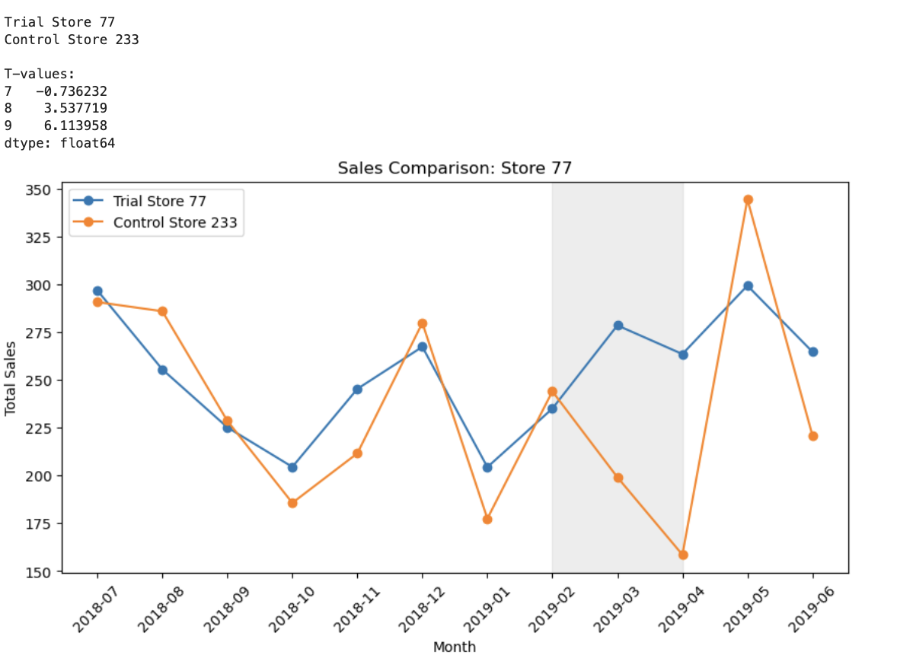
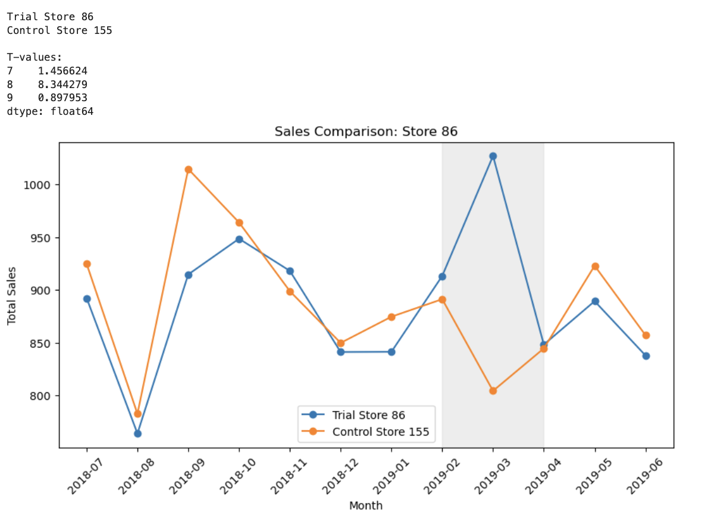
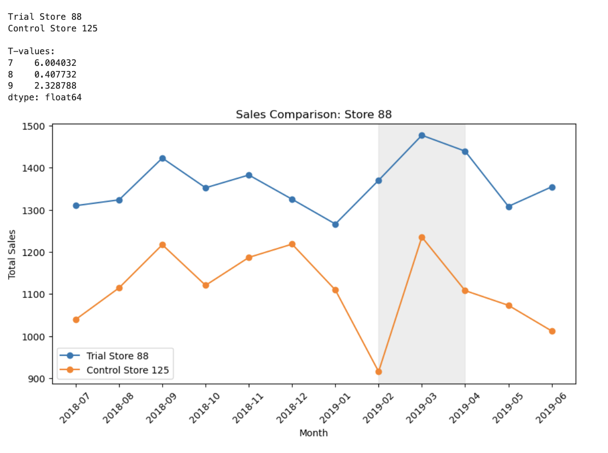
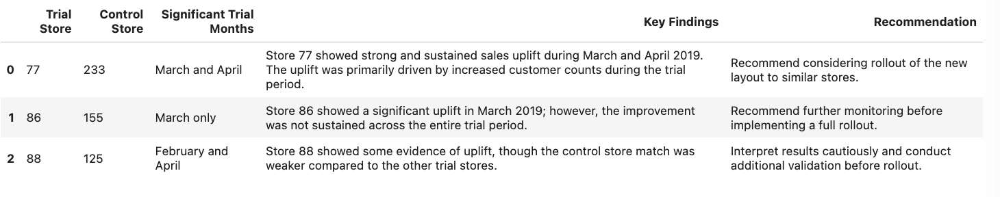

# Quantium Retail Analytics – Experimentation and Uplift Testing

## Project Overview

This project analyzes the impact of trial store layouts introduced in selected retail stores using experimentation and uplift testing techniques.

The objective was to determine whether the trial layouts led to significant improvements in sales performance compared to statistically similar control stores.

---

## Business Problem

Quantium’s retail analytics team was tasked with evaluating trial layouts implemented in Stores 77, 86, and 88.

The analysis focused on:
- Selecting suitable control stores
- Measuring sales uplift during the trial period
- Identifying drivers of change
- Providing business recommendations for rollout decisions

---

## Tools & Libraries Used

- Python
- Pandas
- NumPy
- Matplotlib
- Jupyter Notebook

---

## Key Analytical Steps

### 1. Data Preparation
- Cleaned transaction data
- Converted dates into monthly periods
- Created monthly performance metrics

### 2. Control Store Selection
Control stores were selected using:
- Pearson correlation
- Magnitude similarity scoring

### 3. Uplift Testing
Compared trial stores against control stores during:
- Pre-trial period
- Trial period

Statistical testing was performed using t-values to determine significant uplift.

### 4. Visualization
Created visual comparisons for:
- Total sales
- Customer counts
- Transactions per customer

---

## Key Findings

### Store 77
- Strong and sustained sales uplift
- Increase driven mainly by customer counts
- Recommended for rollout consideration

### Store 86
- Significant uplift observed mainly in March 2019
- Further monitoring recommended

### Store 88
- Some uplift observed
- Results should be interpreted cautiously due to weaker control-store matching

---

## Skills Demonstrated

- Experimental design
- Uplift testing
- Statistical analysis
- Correlation analysis
- Data visualization
- Business storytelling
- Python analytics workflow

---

# Visual Analysis

## Store 77 Sales Comparison

---

## Store 86 Sales Comparison

---

## Store 88 Sales Comparison

---

# Final Recommendations

